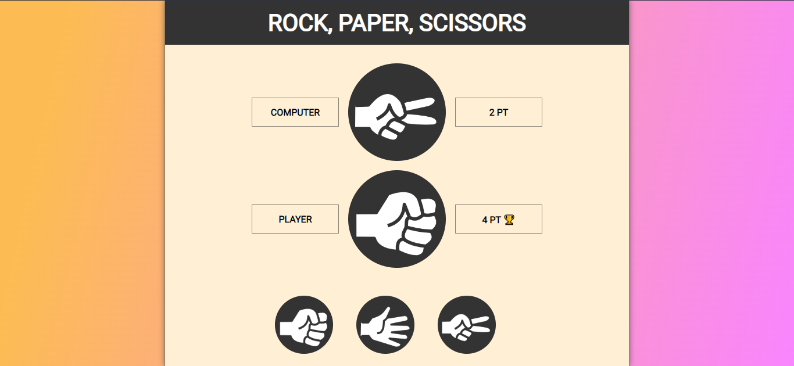

# FreeCodeCamp - rock-paper-scissors

This is my solution to the **rock-paper-scissors game** taught by [Ania Kubów](https://github.com/kubowania) on FreeCodeCamp.

## Table of contents

- [Overview](#overview)
  - [Screenshot](#screenshot)
  - [Links](#links)
- [My process](#my-process)
  - [Built with](#built-with)
- [Author](#author)
- [Acknowledgments](#acknowledgments)

## Overview

### Screenshot

#### Light Theme

#### Dark Theme

### Links

- Live Site URL: [ropas](https://ropas.netlify.app/)

## My process

### Built with

- Semantic HTML5 markup
- CSS custom properties
- CSS Animations
- Flexbox
- Light + Dark Theme
- Responsive web design

## Author

- Twitter - [@Lamy237](https://www.twitter.com/Lamy237)

## Acknowledgments

- [FreeCodeCamp: Learn JavaScript by Building 7 Games](https://www.youtube.com/watch?v=ec8vSKJuZTk&t=116s)
- [GitHub: kubowania](https://github.com/kubowania/rock-paper-scissors-x3)
